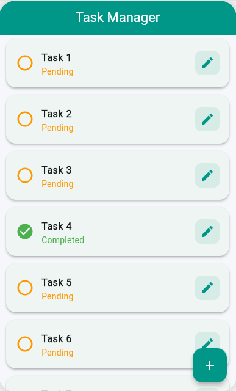
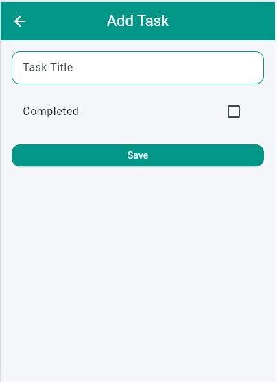
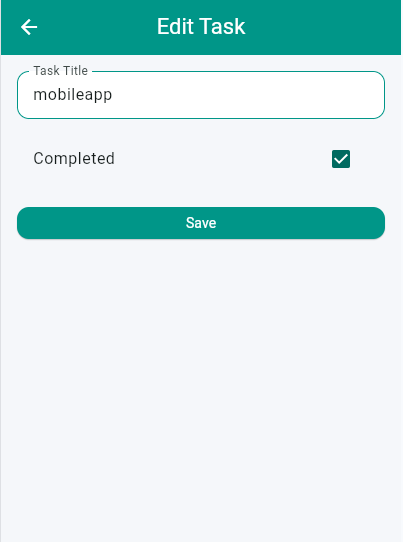
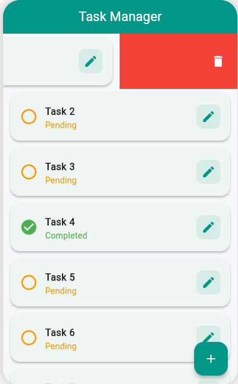
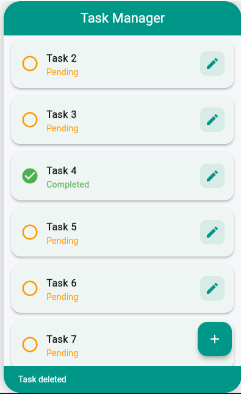

# 📱 Task Manager App (Flutter CRUD with Bloc + Dio)

A Flutter CRUD application built using **Bloc state management** and **Dio HTTP client**.  
The app performs full Create, Read, Update, and Delete operations using the JSONPlaceholder API.

---

## ✨ Features

-  Fetch and display tasks from API
-  Add new tasks
-  Edit existing tasks
-  Delete tasks (Swipe to delete)
-  Loading states
- Error handling
-  Modern card-based UI

---

##  Tech Stack

- Flutter
- Bloc (`flutter_bloc`)
- Dio
- JSONPlaceholder API

---

##  API Used

https://jsonplaceholder.typicode.com

---

##  Screenshots

### Home Screen

---

###  Add Task Screen

---

###  Edit Task Screen

---

###  Delete Task Feature

#### Delete Action 1

#### Delete Action 2

---

##  Project Structure

